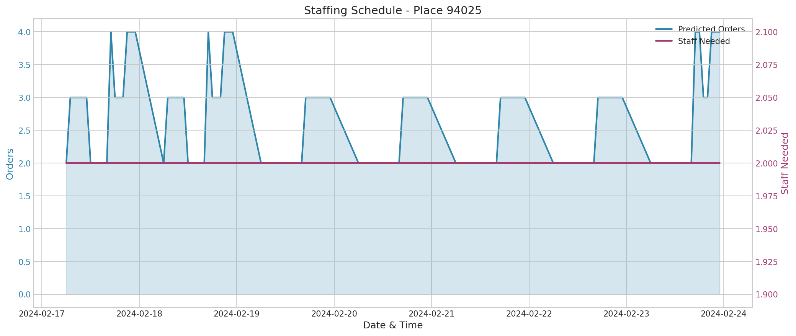

#  Shift Planning Decision Assistant

> AI-powered demand forecasting and staffing optimization for Quick Service Restaurants

[](https://www.python.org/downloads/)

##  Problem Statement

Restaurants struggle with **unstable demand** and **staffing inefficiencies**:

- Sudden demand spikes (weekends, viral social media, events)
- Call-offs that break schedules
- Overstaffing increases labor costs
- Understaffing hurts service quality and burns out staff

##  Our Solution

A **web-based decision-support system** that:

1. **Forecasts hourly demand** using historical order data and machine learning
2. **Translates demand into staffing requirements** per shift
3. **Highlights under/over-staffed periods** with visual alerts
4. **Supports real-time re-planning** when disruptions occur (call-offs, events)



---

##  Quick Start

### Prerequisites

- Python 3.10 or higher
- pip (Python package manager)

### Installation

```bash
# Clone the repository
git clone https://github.com/yourusername/Shift_wizard.git
cd Shift_wizard

# Install dependencies
pip install -r requirements.txt
```

### Running the Pipeline

```bash
# Step 1: Load and clean the data
python dataloader.py

# Step 2: Generate forecasts and staffing schedules
python shift_planner.py

# Step 3: Launch the interactive dashboard
streamlit run dashboard.py
```

---

## 📁 Project Structure

```
Shift_wizard/
├── 📄 dataloader.py          # Data loading and cleaning pipeline
├── 📄 shift_planner.py       # Forecasting and staffing engine
├── 📄 dashboard.py           # Interactive web dashboard
├── 📄 requirements.txt       # Python dependencies
├── 📄 README.md              # This file
│
├── 📁 data/                  # Raw CSV files (not committed)
│   ├── dim_campaigns.csv
│   ├── dim_places.csv
│   ├── fct_orders_sample_150k.csv
│   └── ...
│
├── 📁 cleaned_data/          # Cleaned datasets (generated)
│   ├── hourly_demand.csv     #  Key file for forecasting
│   ├── fct_orders.csv
│   └── ...
│
└── 📁 shift_planning_output/ # Reports and visualizations (generated)
    ├── weekly_schedule.csv
    ├── daily_summary.csv
    ├── staffing_alerts.csv
    ├── demand_heatmap_*.png
    └── report_*.txt
```

---

## 🔧 Components

### 1. Data Pipeline (`dataloader.py`)

**Purpose:** Cleans and prepares raw data for analysis.

**Features:**
-  Loads all CSV files from `data/` folder
-  Standardizes column names (snake_case)
-  Converts Unix timestamps to datetime
-  Removes sensitive/PII data (emails, phones, addresses)
-  Generates `hourly_demand.csv` aggregation

**Input:** Raw CSV files in `data/` folder  
**Output:** Cleaned CSVs in `cleaned_data/` folder

```bash
python dataloader.py
```

---

### 2. Forecasting Engine (`shift_planner.py`)

**Purpose:** Predicts demand and calculates staffing requirements.

**Features:**
-  **Machine Learning Model:** Random Forest Regressor
-  **Features Used:**
  - Place ID
  - Hour of day
  - Day of week
  - Month / Week of year
  - Weekend flag
  - Lunch/Dinner peak flags

**Model Performance:**
| Metric | Value |
|--------|-------|
| MAE    | ~1.35 orders |
| RMSE   | ~2.05 orders |

**Staffing Parameters (configurable):**
| Parameter | Default | Description |
|-----------|---------|-------------|
| `ORDERS_PER_STAFF_PER_HOUR` | 8 | Orders one staff member can handle |
| `MIN_STAFF_PER_SHIFT` | 2 | Minimum staff always on duty |
| `MAX_STAFF_PER_SHIFT` | 15 | Maximum staff capacity |

```bash
python shift_planner.py
```

---

### 3. Interactive Dashboard (`dashboard.py`)

**Purpose:** Visual interface for exploring forecasts and managing schedules.

**Features:**
-  Demand forecast visualization
-  Weekly heatmap of busy periods
-  Staffing recommendations by shift
-  Alert system for understaffing
-  **Real-time re-planning:**
  - Staff call-off handling
  - Demand spike simulation
  - Event/promotion planning
- Export schedules to CSV

```bash
streamlit run dashboard.py
```

Then open: **http://localhost:8501**

---

##  Data Schema

### Input Data (Star Schema)

| Table | Description | Key Columns |
|-------|-------------|-------------|
| `fct_orders` | Order transactions | `id`, `place_id`, `created`, `total_amount` |
| `fct_order_items` | Line items per order | `order_id`, `item_id`, `quantity` |
| `dim_places` | Restaurant locations | `id`, `title`, `timezone` |
| `dim_users` | Customer records | `id`, `created`, `orders` |
| `dim_campaigns` | Marketing campaigns | `id`, `place_id`, `type` |

### Generated Data

| File | Description | Columns |
|------|-------------|---------|
| `hourly_demand.csv` | Hourly order aggregation | `place_id`, `date`, `hour`, `weekday`, `orders` |
| `weekly_schedule.csv` | Staffing schedule | `date`, `hour`, `predicted_orders`, `staff_needed`, `shift` |
| `staffing_alerts.csv` | Understaffing warnings | `date`, `hour`, `shortage`, `alert_level` |

---

##  Real-Time Re-Planning

The dashboard supports handling disruptions in real-time:

### Scenario 1: Staff Call-Off
```
Input: 2 staff members call off for Tuesday evening shift
Output: System recommends calling in 2 additional staff
        Shows adjusted schedule with coverage gaps highlighted
```

### Scenario 2: Unexpected Demand Spike
```
Input: Expected 50% demand increase due to nearby event
Output: System increases demand forecast
        Recommends additional staffing for affected hours
```

### Scenario 3: Planned Event
```
Input: Restaurant hosting private event Saturday afternoon
Output: System models increased demand
        Generates optimized staffing plan
```

---

##  Security & Privacy

This project follows hackathon security requirements:

-  **No sensitive data committed** to repository
-  **PII removed** during data cleaning:
  - Emails, phone numbers
  - Customer names, addresses
  - Passwords, API keys
  - GPS coordinates
-  **No hardcoded credentials**
-  `data/` folder in `.gitignore`

---

##  Model Explainability

The forecasting model is interpretable:

### Feature Importance
| Feature | Importance |
|---------|------------|
| `place_id` | 61.1% |
| `hour` | 17.0% |
| `day_of_week` | 6.0% |
| `week_of_year` | 5.8% |
| `day_of_month` | 4.6% |

### Key Insights
- **Location matters most:** Different restaurants have very different demand patterns
- **Time of day is critical:** Lunch (11-14) and dinner (18-21) show clear peaks
- **Weekend effect:** Saturday/Sunday typically have ~20% higher demand

---

##  Testing

```bash
# Run the full pipeline
python dataloader.py
python shift_planner.py

# Verify outputs exist
ls cleaned_data/
ls shift_planning_output/
```

Expected outputs:
- `cleaned_data/hourly_demand.csv` (58,737+ rows)
- `shift_planning_output/weekly_schedule.csv` (126 rows for 7-day forecast)
- 4 PNG visualization files
- 1 TXT report file

---

##  Configuration

### Adjusting Staffing Parameters

Edit `shift_planner.py`:

```python
# Staffing parameters (adjust based on restaurant capacity)
ORDERS_PER_STAFF_PER_HOUR = 8   # Increase for efficient staff
MIN_STAFF_PER_SHIFT = 2         # Minimum coverage
MAX_STAFF_PER_SHIFT = 15        # Physical capacity limit
```

### Adding New Data Sources

1. Place new CSV files in `data/` folder
2. Update `files` dictionary in `dataloader.py`
3. Re-run the pipeline

---

##  Requirements

```txt
pandas>=2.0.0
numpy>=1.24.0
matplotlib>=3.7.0
scikit-learn>=1.3.0
streamlit>=1.28.0
plotly>=5.18.0
```

Install all:
```bash
pip install -r requirements.txt
```

---

##  Team

Built for **Hackathon 2024** by:

| Team Member | Role | Contributions |
|-------------|------|---------------|
| **Yassin Zohair** | Project Lead & DevOps | GitHub repo setup, version control, project architecture, deployment |
| **David Gamal** | Full Stack Developer | API development (FastAPI), React frontend, backend integration, ML pipeline |
| **Ali Yasser** | ML Engineer | Demand forecasting model, feature engineering, model evaluation, accuracy metrics |
| **Ahmed Reda** | Data Engineer | Data cleaning pipeline, data validation, CSV processing |
| **Fady Samer** | Backend Developer | Smart alerts system, staffing calculator, disruption handling, API endpoints |
| **Omar Elraffa** | UI/ & Documentation | Dashboard design, user experience, presentation materials |

---

##  Acknowledgments

- Historical order data provided by hackathon organizers
- Built with Python, Pandas, Scikit-learn, Streamlit, and Plotly
